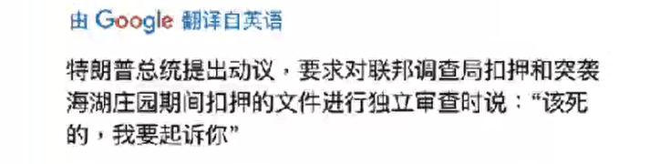

# 词汇汇总

> :: 持续更新

> 四级词汇，主要采用词根词缀法记忆，例如 insurmountable
>
> 将其拆分为 in（不）+ sur（超过）+ mount（山峰）+ able （形容词性后缀）->不可跨越的山峰->难以克服的

---

## list1-5

### list 1 view（看；被看见的）

1. view v.认为 n.观点；风景

   > 认为和观点两个意思都是**脑中**看见，而风景是**眼中**看见（英文常见构词法）。

2. review n. v.回顾；复习；评论

   re->再一次 可由 restart“重启”推导出，再一次开始=重启

   > re view，由词根 re 和 view 推导本意为再看一眼，由不同的身份得到语境推导意思。

   回顾既是再看一眼，学生再看一眼=复习，评委/老师等再看一眼=评论（给一个东西）

3. interview n. v.采访；面试；面谈

   inter->相互 可由 internet“互联网”推导出，相互连接的网=互联网

   > inter view，由词根 inter 和 view 推导本意为相互看，由不同的身份得到语境推导意思。

   采访：和记者相互看

   面试：和面试官相互看

   面谈：和朋友相互看

   interview**ee** n.被面试者，被接见者，被访问者

   interview**er** n.采访者，会见者，进行面试者

   ee：动作的承受者，如：employee，员工（被雇佣者）

   er：动作的发出者，如：employer，老板（雇佣别人的人）

   a job interview 求职面试

   a TV interview 电视采访

### list2 quire/quest/quer（to ask 询问，to seek 寻找）

1. question n. 问题 v. **质疑；怀疑**

   可由这个词推导 quest 词根的含义，quest|ion，后面 tion 为名词性后缀，则前面 quest 含义为问。

   **四六级常考其质疑和怀疑的意思。**

   questioned her **judgement**

   怀疑她的**判断**（质疑一件事）

   **She** was questioned about the fire.

   **她**被质问有关火灾的事情。（质疑人）

2. request n. v. 请求；需要

   > re quest，re 表示再，再一再二再三->再三询问->你要不要喝点啥？你需要什么吗？->需要。

   （正式）our final request 我们最后的请求

   request sb to do sth **请求**某人做某事

3. require n. v. 需要；需求（=need）

   > re quire，同 request。

   Thest pets require/need a lot of care.

   这些宠物需要悉心照顾。

   Do you require/need anything else?

   你还需要什么吗？

   requirement n. 要求；必要条件

   **meet** requirement 满足需求条件

   ```
   request	n. v. 请求；需要（“请”），比较正式、客气
   巧记：其中quest像“guest（客人）”，请

   require	v. 需要；要求（=need）中性词
   ```

4. acquire v. 获**得**；取**得**；学**到**

   > ac quire，a+辅音字母表示强调，强调问->你得问呐！！！->学到，取得

   acquire knowledge/skills 获取知识/技能

5. inquire v. 询问；查**究**

   > in quire，in：向内，进来->问到内部->究

   I want to inquire about your salary.

   我想问一下你的工资。

6. conquer v. 征服

   > con quer，con 表示共同、强调，共同寻找会克服困难->征服

   巧记：坎坷（谐音），conquer（坎坷）需要征服

   conquer your fear 克服恐惧（联想：克服：overcome（范围较小），开头的 surmount（去掉 in 和 able，词根词缀的魅力））

   conquer the world 征服世界

### list3 duce/duct/duc（to lead 引导；拉）

1. produce v. 生产；引起；创作

   > pro duce，pro 表示向前（forward），这个词几百年前就已经出现，当时的生产尤指织品，如何生产呢？纺完往前拉，就生产出来了，所以 duce 取拉，引导的意思->生产

   producer n. 生产商

   product n. 产品；产物——**结果**（英语构词法）

   production n. 产生；制造——**过程**

   productive adj. 多产的；有成效的

   productive workers 高效（多产的）工人

   a productive meeting 有成效的会议

   byproduct n.副产品

   > by product，by 表示旁边的->旁边的那个东西->副产品（中性词，根据语境褒贬不一）

   productivity n. 生产力；生产率

2. educate v. 教育；培养

   > e duc ate，e（ex）表示出（ex|it（出它）出口），duc 表示引导，ate 动词词尾，引导出去->走出自己的窠臼->（正式）教育，内容比 teach 广泛（educate包含了周围人言传身教、家庭的影响、熏陶）

   teach：“教”；普通用语，教授具体知识、技能

   train：训练、培养（教练）

   tutor：一对一、一对少（如同桌给同桌讲题，不用 teach，用 tutor）

   I will tutor you：我教你

   education n. 教育；培养

   higher education 高等教育（含大学及以上的教育，专科、本科、硕士、博士）

   educational adj. 教育的；有教育意义的

3. conduct n. 行为 v. 实施；引导；指挥；经营；传（热、电等）

   > con 表示共同、强调，con|duct->共同引导->引导员工干一件事（语境）->经营
>
   > 引导乐队……->指挥
>
   > 引导所有的热从高温到低温（电从高电压到低电压）->传热，导电
>
   > 引导->引导
>
   > 引导就是实施的一个小词，而实施就是一种行为

   conduct business 做生意（不用 do，do 口语化，不高级，类似汉语的“弄一下”、“整一下”）

   I am deeply hurt by her conduct. 她的行为深深地伤害了我。

4. induce v. **诱**导；劝说；导致（情感色彩偏贬义，**尤指做不明智的事**）（劝说=persuade）

   > in duce，in 表示进来->引导着进你的脑子(imposr——强加，im 和 in 相似表示进来，放进脑子)->劝说；诱导 
>
   > 相似逻辑：inform——通知(in 进来，form 形成，在脑中形成观念)——英文构词法

   induce me to take the job

5. reduce v. 减少；减低

   > re duce，re 表示向后，向后拉->走太快了，给他向后拉，慢点->减少，降低

   reduce the speed 减速

   reduce the risk 降低风险

   reduction n. 减少；下降

6. introduce v. 介绍；引进

   > intro duce，intro 表示在内，向内（within）=in->引进来，拉进来->介绍，引进

   intorduced A to B 把 A 介绍给 B（引荐）

   The new law was introduced in 1991.

   这项新法律是与 1991 年开始实施（引入）

   introduce the technology to the world

   把这项技术推向世界（引向）

   **关键词：“引”（to lead）**

   introduction n. 介绍（引入）；引进；前奏（引入音乐的前面一小段）；序言（引入一本书的前面一小段）

7. reproduce v. 复制；繁殖

   > re produce，re 表示再->再一次生产出来->复制，繁殖

   reproduction n. 复制；繁殖

   reproductive adj. 繁殖的

### list 4 fess（to say，to talk 说）

1. professor n. 教授；教师

    > pro fess or：pro-前，fess-说，or-人->站在前面说话的人（古罗马很多人发表讲话）->教授；教师

   profession n. 职业，专业；声明（需要专门技能，或较高教育水平的领域如医生、教师、律师等）

   > 大体和 professor 一样，注意**声明**，我声明个东西->也是在前面对别人说话，逻辑成立

    the medical/legal profession 医学专业、法律专业

   proffessional adj. 专业的；职业的 n. 专家；人才

   （confess->con fess，con 全，fess 说->全对上帝说->忏悔）

### list 5 just/jur/jud（law 法律，right 正义）

1. just adj. **公正的，合理的；正直的** adv. 只是；刚才

    > just 单词的来源：
   >
   > 

 I just saw him 我刚还见过他

 a just decision/society 一个公正的决定/社会

 justice n. 公平，公正

 ce->名词词尾

 **justify v. 证明正确；替……辩护（解释）**

> justi fy，前面部分为正义，公正，fy->使成为（to make）->使这个东西正义->如果这个东西本身就正义则只需证明，如果这个东西不是正义的要让他正义就叫“狡辩”、“诡辩”、“洗白”

 justify a war 为战争辩护/洗白

 justify your wrong actions 为你的错误行为狡辩/洗白/辩护

2. adjust v. 调整；校准**（微调）**

    > ad just，ad(a+辅音，要么朝着，要么强调，这里表示朝着)->向着（to/towards）->朝着正确的方向调整

    adjust your speed 调整车速（朝正确的速度调整）

    adjust his tie 整了整他的领带

   adjustment n. 调整，调节

3. injure v. 伤害，损害

    > in jure，in->否定->不正义->会造成损害和伤害

    he injures his knee. 他膝盖受伤。

   injury n. 伤害，损害

4. judge n. 法官；裁判员 v. 判断；裁判；评价

   a High Court judge 高等法院的法官

   The judge's decision is final. 裁判的决定为最终决定。(decision 语境更可能是裁判)

   to judge the competition 担任比赛评委
   
   

## list 6-10

> 复习：[review](https://tryanel.github.io/cet4_word_list/#list-1-view%E7%9C%8B%E8%A2%AB%E7%9C%8B%E8%A7%81%E7%9A%84)
>
> 
>
> 
>
> 此处应当作何意思？（审查（复审更好其实），这个翻译体现出了语境的重要性，如果只记忆单词本上的意思在此处是翻译不出来的，并没有学过复审（法律机构再看一眼））

### list 6 mean （中间的）

1. mean	n. **平均值** v.意味着 adj.刻薄的；**平均的**

   What do you mean?	你什么意思？

   6 is mean of 3,7 and 8.	6是3，7和8的平均数（**中间的**那个值）。

   the mean temperature	平均气温

   You are so mean!	你很刻薄！

   

2. means	n. 手段；方法

   

   > 若干中间的过程->方法

   **all** possible means（复数）	**所有**可能的方法、手段

   **every** possible means（单数）	**每一种**可行的方法

   `单复数同形，具体看语境`

   > by no means = never（通过没有的方法->没法，没辙）

   

3. meaning	n. 意义；含义

   

4. meaningful	adj. 有意义的；意味深长的

   a meaningful discussion	意义非凡的讨论

   

5. meanwhile	adv. 同时，其间 

   The doctor will see you again next week.**Meanwhile**, you must rest as much as possible.

   医生下周还会给你看病。**在此期间**，你一定要尽可能多休息。

   > mean while->中间+时间->中间那段时间，比如例句中，医生下周还会看病，从现在到下周看病中间那段时间要好好休息->其间，同时

### list 7 -age

> <font color="#ee699c">What matters is</font> understanding that **aging** is curable.
>
> <font color="#ee699c">重要的是</font>理解**衰老**是可以治愈的

1. age	n. 年龄；时代 v. 变老

   > 人的年龄->年龄，世界的年龄->时代，年龄变大->变老

   Stone Age	石器时代

   People age.	人是会变老的。

   > People age. 一般现在时，不能翻译成人老了。
   >
   > 一般现在时描述规律、习惯、性质等，可以理解为不受时间影响的。
   >
   > 比如规律，水0℃会变成冰，不管是以前还是现在都不受时间影响，所以用一般现在时。
   >
   > 再比如性质，钻石很硬，昨天今天它都是很硬的，不受时间影响，用一般现在时。

   

2. **aging（ageing）  n. 老化；老龄化**

   aging process	衰老过程

   

3. average  adj. 平均的；普通的 n. 平均；平均数

   average speed	平均速度

   an average（=common） student	一位普通学生

   

4. manage  v. 管理；勉强完成

   > man（manu） age：man-=hand 手，age词尾无意义（就像韩语中的思密达）->用手完成一件事->管理，勉强完成

   manage a factory	管理一个工厂

   I can manage another piece of cake.	我还能再吃一块蛋糕。（一手扶着肚子一手扶着墙说朕还能吃！！的感觉）

   > 还可以翻译成再做一块蛋糕，词本无意，意由境生，看语境。

   I can **manage to** persuade him.	我能**设法**说服他。

   

5. management  n. 管理

   

6. advantage  n. 优势；利益

   take advantage of sth/sb：从……中获益（中性词）

   He **took advantage of** me.	他**利用**了我。/他**占了**我的**便宜**。（贬义）

   We **took** full advantage of te hotel facilities.	我们充分**享用**了旅馆设施。（褒义）

   > 词本无意！！take advantage of sth/sb短语可以理解为将优点从……拿走了（take）
   >
   > 比如第一条例句：我的优点被拿走了，我不想给他->我被占便宜了
   >
   > 第二条：设施的有点被拿走了，我花钱理应享受->享用w

7. disadvantage  n. 缺点；不利条件

8. damage  n. 损害 v. 损毁

   serious damage	严重的损坏

9. message n. 消息 v. 发短信

   > mess age：mess-/miss- = to send（送），to throw（投，掷），发送+age词尾->发出去的东西、发送->消息，发短信

   Please leave a message.	请留下你的信息。

   Tom just messaged/texted me.	汤姆刚给我发来短信。

10. marriage  n.婚姻

    > marri age：marri由marry而来

11. wage  n.工资（周薪）

    ```
    wage（按周发的工钱）：
    如临时工、搬砖等
    a weekly wage of £200	周薪200英镑
    MINIMUM WAGE	最低工资，只能用wage，只能在周工里产生最低工资
    
    salary（按月发的薪水）：
    白领、正经工作
    monthly salary	月薪
    an annual salary	年薪
    以上两词都表示工钱
    -------------------------------
    income（收入、所得）：
    包含上两种，且不止，income指所有进来的钱，正不正规是否工作所得的钱都叫income。
    只要是到我这来的钱就是income
    higher/ middle/ lower income	较高、中等、较低收入
    (因为高和低永远没有限度，永远有更高和更低，所以用比较级)
    ```

    

12. image  n.映像；想象 v.想象；反映；象征

    public image	公众形象（人设/标签）
    a wooden image	一个印在木头上的形象（一个样）

    

13. package  n.包裹 v.打包（**以出售或运输**）

    > pack age：pack打包，age词尾->打包出来的东西->包裹

    There is a large package for you.	你有一个大包裹。

14. luggage  n.行李（英）**不可数**

    a lot of luggage	很多行李
    two pieces of luggage	两件行李

15. baggage  n.行李（美）=luggage

    

16. shortage  n.缺乏；不足

    food/ water shortage	食物╱用水短缺

17. stage  n.舞台；阶段 

    the political stage	政治舞台
    early stage	早期阶段

### list 8 techn（art/skill 技艺/技术）

1. technology  n.科技；`技术(强调科学的“科”)`

   Information Technology (IT)信息技术

2. technological  adj.科技的；工艺的；<font color="#9896f1">技术的</font>

3. technique  n.技巧；`技术(强调熟练度，“技巧”)`

   painting techniques	绘画技巧

   > 与此相对应：
   >
   > 

4. technical  adj.技能的；<font color="#9896f1">专门技术的</font>

5. technician  n.技术员

   `不需要很高的技术需求，比如去实验室刷个烧杯也能叫technician`

### list 9 fer（to carry 拿来，to bring 带来）

1. offer  v.提供 n.工作邀请

   > of-：朝向，of fer朝着某一个方向carry/bring
   >
   > 如google给了你一个offer相当于谷歌朝着你的方向拿了个东西给你->提供、邀请
   >
   > 记个感觉，carry-用手拿、用身体某个部位抱、举、拿，bring-带到东来带到西
   >
   > 词源词典：
   >
   > 

   offer some advice	提出一些建议
   accept / refuse an offer	接受/拒绝好意

2. refer  v.查阅；参考；提及

   > re fer：re再，fer带着->再一再二再三带着……，一再搬出来……

   He never **referred to** him.他从没有提起过他。（一再搬出来他，提及他）
   **refer to** my note	查阅笔记（一再带着笔记，为了查阅）

   <font style="border: 2px dashed #000000;padding:2px">refer to A as B	把A称作B</font>

3. reference  n.参考

4. differ  v.不同于<font color="#ee699c">(=be different)</font>

   > differ ent：v+adj词尾，不同->differ  v.不同于

   <p style="border: 2px dashed #000000; padding:2px;background-color:#fafafa">法语不同于英语。<br>
   French differs from English.<br>
   French and English differ.</p>

5. indifferent  adj.漠不关心的

   > in different：in 否定，different 不同->没什么不同->都行，随便->漠不关心

   an indifferent society 	一个冷漠的社会

6. prefer  v.较喜欢

   > pre fer：pre- 先，fer 拿->先拿->更倾向于（和喜欢的意思没关系）
   >
   > 比如Tea or coffe？假设我都不喜欢，我说了I'd prefer tea. 不能说是我喜欢茶
   >
   > 只是我相比更愿意喝茶（先拿茶）

7. preference  n.偏好；偏爱

8. suffer  v.受苦；遭受

   > suf fer：sub-(suc-,suf-,sug-,sum-,sup-,sur-,sus-) = under 在下面（sur还有在上面的意思，只能记了）
   >
   > fer carry->在下carry->举着、背着、扛着->感觉重量压在我的身上->我在<font color="#ee699c">忍</font>->受苦、遭受
   >
   > sustain  维持（hold）也有一种<font color="#ee699c">忍</font>的感觉

   He suffers.	他很痛苦。
   He suffers from depression.	他患有抑郁症。

9. conference  n.会议

   > con fer ence：con-：共同、一起；fer 拿来、带来；ence 名词词尾->把很多东西带到一起来->把所有观点拿到一起来->开会（而且是大会，因为是各种观点一起求同存异，通常需要持续几小时或者几天）
   >
   > 相比meetint（碰头会），十几分钟都能解决

10. infer  v.推断

    > in fer：in 里面；fer 拿出来->从里面拿出来->通过一些细节或者线索从里面拿出来而不是在外面看出来->推断

    l can infer what you are thinking.	我能推断出你在想什么。

    

11. interfere  v.干涉

    > inter fere：inter-：between/among 在…之间（还有相互的意思）；fer 带->带到中间->到中间横插一杠、插手插足->干涉

    interfere in（某人进入情况`内部`插手）
    	He does not want to interfere in the internal affairs.	他不想干涉内部事务。
    interfere with（人或物在`旁边`影响）
    	Smoking interferes with your health.	吸烟妨碍身体健康。

12. interference  n.干涉

13. transfer  v.转学，调动；转移  n.转移；换乘（发音的重音“名前”）

    > trans-：across  ~~转移、贯穿~~ 从A到B->从A拿到B->转移
    
    He transferred to UCLA.	他转学到加州大学洛杉矶分校。
    He transferred the money to his son.	他把钱转给了儿子。
    
    transfer station	换乘站
    
    (还可以表达：热转移、能量转移、工作调动、案件移交、转移电脑数据、转移手机通讯录…）

### list 10 lead（引导、引领）

