## 第一章 操作系统引论

## 1.1 操作系统概念

计算机系统是有硬件和软件组成的

- 硬件是指计算机物理装置本身。是软件建立与活动的基础；
- 软件是计算机执行的程序。是对硬件进行管理和功能扩充。

### 1.1.1 计算机硬件结构

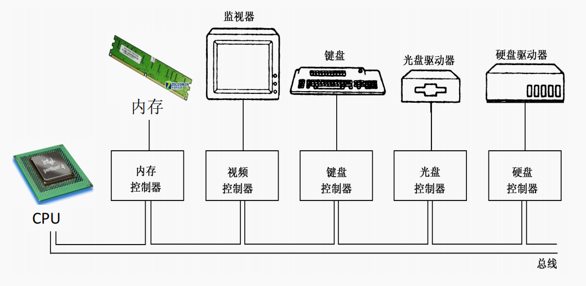

- 指令是控制计算机执行某种操作（如加、减、传送、转移等）的命令。

- 特权指令是一类具有特殊权限的指令，只用于操作系统或其他系统软件，普通用户不能直接使用。

- 非特权指令也称为用户指令或普通指令，是普通用户能够直接使用的指令。这是指令集中除特权指令外的所有指令。

- CPU 的两种运行模式：

  - 内核态（又称核心态、系统态、管态）：

    > 处理机执行操作系统程序时，有较高特权

  - 用户态（又称目态）：

    > 处理机执行用户程序时

- 两种运行模式（执行状态）可以相互转换

### 1.1.2 什么是操作系统

- 操作系统是控制和管理计算机系统内各种硬件和软件资源、有效地组织多道程序运行的系统软件（或程序集合），是用户与计算机之间的接口。

  1. 操作系统是软件，而且是`系统`软件
  1. 它的基本职能是`控制和管理`系统内各种资源，有效地`组织`多道程序的运行
  1. 它`提供众多服务`，方便用户使用，`扩充`硬件功能

- 操作系统作为扩展机器通常把裸机之上覆盖各种软件，从而形成功能更强的机器称为`扩展机器`或`虚拟机`
- 操作系统作为`资源管理器`
  1. 监视各种资源，随时记录它们的状态
  2. 实施某种策略以决定谁获得资源，何时获得，获得多少
  3. 分配资源供需求者使用
  4. 回收资源，以便再分配

### 1.1.3 操作系统的地位

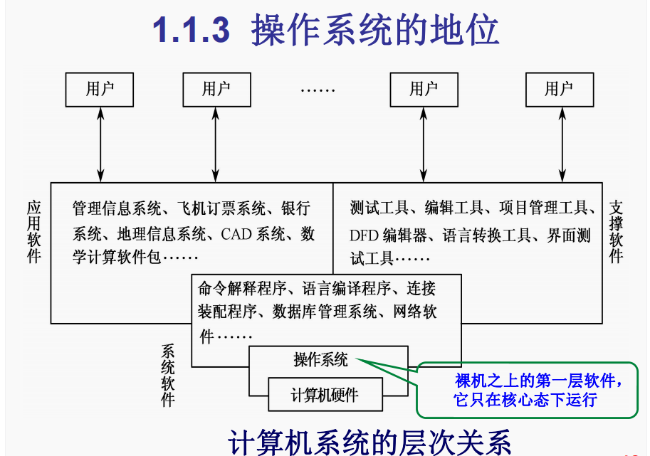

注：软件通常可分为三大类：

- 系统软件——对计算机系统的资源进行控制、管理，并为用户的使用和其他程序的运行提供服务
- 应用软件——是为解决某一类应用需要或某个特定问题而设计的程序
- 支撑软件——是辅助软件技术人员从事软件开发工作的软件

## 1.2 操作系统的主要功能

从资源管理观点看，操作系统具有五大功能：

- 处理机管理

  作业和进程调度、进程控制、进程通信

- 存储器管理

  内存分配、地址映射、内存保护、内存扩充

- 设备管理

  缓冲区管理、设备分配、设备驱动、设备无关性

- 文件管理

  文件存储空间的管理、文件操作的一般管理、目录管理、文件的读写管理和存取控制

- 用户接口

  - 程序接口

    ```c
    #include <sys/types.h>
    #include <sys/stat.h>
    #include <fcntl.h>
    //……
    fd=open("file.c",2);
    ```

  - 命令行接口

    $ date

  - 图形用户接口（GUI）

    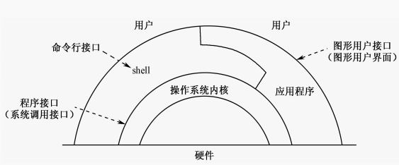

  UNIX 系统体系结构：

  ​ 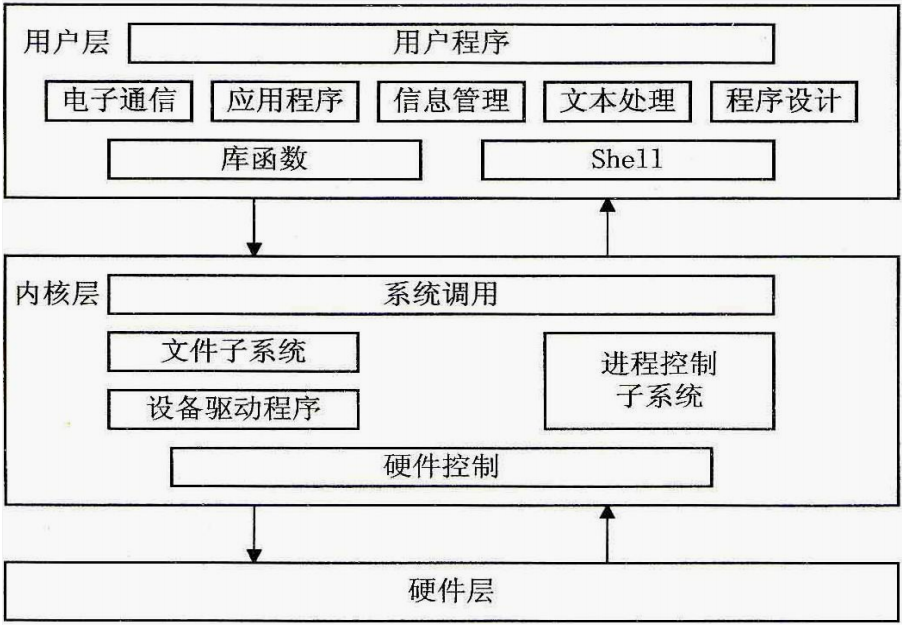

  在操作系统中，所有内核之外的程序都必须`经由系统调用`才能获得操作系统的服务。系统调用`只能在程序中使用`，不能直接作为命令在终端上输入和执行。由于系统调用能够改变处理机的执行状态，所以其`执行效率很高`

  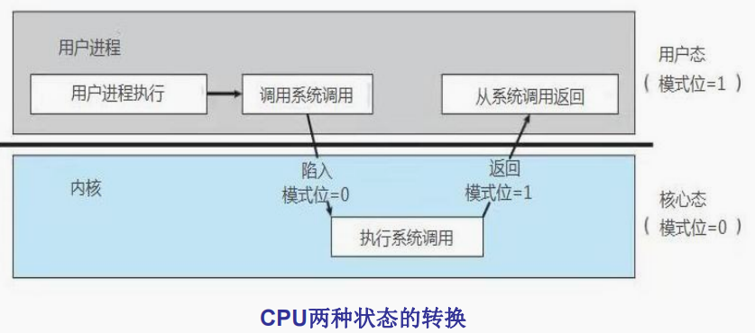

## 1.3 操作系统的特征和服务

- 操作系统的特征

  - 并发

    两个或多个活动在`同一给定的时间间隔`中进行。

  - 共享

    计算机系统中的资源被`多个进程`所`共用`。

  - 不确定性（异步性）

    系统中各种事件发生顺序的`不可预测`性。另外，同一程序在相同的初始数据下，无论何时运行都应获得同样的结果。

  - 抽象性

    抽象是把`复杂事情简单化`的有效方式。

### 并发性

- `并行`是指两个或多个事件在同一时刻发生。
- `并发`是指两个或多个事件在同一时间间隔内发生。
- 程序的并发执行，有效地`改善`了系统资源的利用率和提高了系统的吞吐量，但它使系统`复杂`化，操作系统必须具有控制和管理各种并发活动的能力。

### 共享性

- 操作系统与多个用户的程序`共同使用`计算机系统中的资源
- 资源`共享`是指系统中的硬件和软件资源不再为某个程序所独占，而是供多个用户共同使用
- 并发和共享是操作系统两个`最基本`的特征，这两者之间又是`互为存在条件`的
- 资源共享是以程序的并发为条件的，并发技术是以资源共享为基础的
- 若系统不能对资源共享实施`有效的管理`，也必将影响到程序的并发执行，甚至根本无法并发执行

### 异步性

- 在多道程序环境下，允许多个进程并发执行，但由于`竞争资源`等因素的限制，使进程的执行不是“气呵成”，而是以“`走走停停`”的方式运行。
- 多道程序环境下程序的执行，是以异步方式进行的；每个程序在何时执行，多个程序间的执行顺序以及完成每道程序`所需的时间`都是`不确定`和`不可预知`的。进程是以人们不可预知的速度向前推进，此即进程的异步性。

### 抽象性（虚拟性）

在操作系统中，所谓虚拟，是指把一个物理上的实体，变为若干个逻辑上的对应物。物理实体(前者)是实的，而后者是虚的，相应地，用于实现虚拟的技术，称为虚拟技术。在 OS 中利用了多种虚拟技术，分别用来实现虚拟处理机、虚拟内存、虚拟外部设备和虚拟信道等。

### 操作系统提供的服务和方式

1. 服务项目

   程序执行、I/O 操作、文件系统管理、出错检测、通信、资源分配、统计、保护

2. 服务方式

   1. 系统调用

      系统调用是操作系统提供的、与用户程序之间的接口，也就是操作系统提供给程序员的接口。它一般位于操作系统核心的最高层

      从感觉上系统调用类似于过程调用，都由程序代码构成，使用方式相同——调用时传送参数

      两者有实质差别：过程调用只能在用户态下运行，不能进入核心态；而系统调用可以实现从用户态到核心态的转变

      系统调用可分为 5 个类别：进程控制、文件管理、设备管理、信息维护和通信。

   2. 系统程序

      它们解决带`共性`的问题，并为程序的开发和执行提供更方便的环境

      <font style="border: 2px dashed #000000;padding:2px">
      系统程序不是操作系统的组成部分，
      最重要的系统程序就是命令解释程序
      </font>

## 1.4 操作系统的形成和基本类型

### 1.4.1 操作系统的形成和发展

1. 手工操作阶段
2. 早期批处理阶段

   - 早期**联机**（**单道**）批处理
   - 早期**脱机**批处理

3. 多道批处理系统

早期联机批处理：

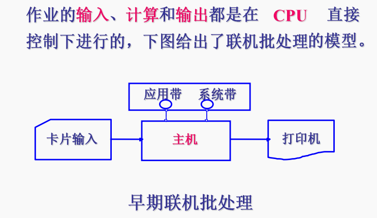

脱机输入/输出方式：

采用脱机输入输出方式时，程序和数据的输入输出都是在外围计算机的控制下完成的，即它们是脱离主机进行的，故称之为脱机输入输出操作。其主要优点如下：

1、减少了 CPU 的空闲时间

2、提高 I/O 速度

多道程序设计的基本概念

在计算机内存中同时存放若干道已开始运行尚未结束的程序，它们交替运行，共享系统中的各种硬、软件资源，从而使处理机得到充分利用。在该系统中，用户所提交的作业都先存放在外存上并排成一个队列，称为“后备队列”；然后，由作业调度程序按一定的算法从后备队列中选择若干个作业调入内存，使它们共享 CPU 和系统中的各种资源。

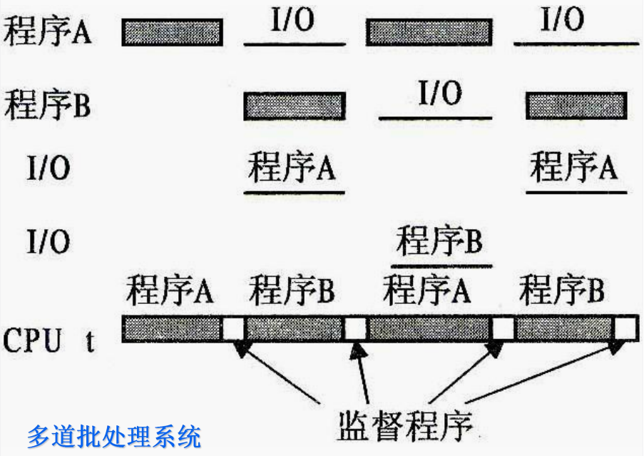

- 系统吞吐量：

  在一段给定的时间内，计算机所能完成的总工作量。

- 系统开销（system overhead）：

  一般是指运行操作系统程序、对系统进行**管理**所花费的**时间和空间**

  由于多道程序运行时的**物理实体**及支持其运行的**物理环境**(如系统堆栈、地址映射寄存器、打开文件表 PSW、PC、通用寄存器等)涉及的内容较多，任务间的切换需要一定的时间才能完成，这是系统为实现并发而付出的额外代价，属于系统开销的一部分。

### 1.4.2 操作系统的基本类型

<font color="red">最基本类型：</font>

- 批处理系统
- 分时系统
- 实时系统

以后又发展出：网络操作系统、分布式操作系统等

1. 批处理系统

   - <font size=5px>作业</font>是用户定义的、由计算机完成的工作单位包括一组计算机程序、文件和对操作系统的控制语句->`作业控制语言（JCL）`

   - <font size=5px>作业步</font>是由作业控制语句明确标识的计算机程序的执行过程

   - 特点

     - 多道：系统在**内存**中存放多个作业，并且在**外存**上还保存大量的后备作业。

     - 成批：系统**按批次调度**作业，而在系统运行过程中**不允许**用户和机器之间发生**交互**作用。

       

2. 分时系统

   - 分时系统的思想：

     - 采用**时间片轮转**的方法，同时为许多终端用户服务，对每个用户能保证足够快的响应时间，并提供交互会话的功能。
     - **时间片**：将 CPU 的时间划分成若干个片段，称为时间片，操作系统以时间片为单位,轮流为每个终端用户服务
     - 设计目标：对用户的请求及时响应，并在可能条件下尽量提高系统资源的利用率。
     - 适合办公自动化、教学及事务处理等要求人机会话的场合。

   - 分时系统特点

     - 同时性

       同时有多个用户使用一台计算机

       宏观上：是多个人同时使用一个 CPU

       微观上：多个人在不同时刻轮流使用 CPU

     - 交互性

       用户根据系统响应结果进一步提出新请求（用户直接干预每一步）

     - “独占”性

       用户感觉不到计算机为其他人服务（OS 提供虚机器，各个用户的虚机器互不干扰）

     - 及时性

       系统对用户提出的请求及时响应

3. 实时系统
   - “实时”，是表示“**及时**”，而实时系统(Real-TimeSystem)是指系统能及时响应外部事件的请求，在**规定的时间**内完成对该事件的处理，并控制所有实时任务协调一致地运行
   - 特点：**及时性**要求高，系统**可靠性**高。实时系统必须和**先进的技术装备**相结合

几种操作系统的比较：

|              |    多道批处理系统    |       分时系统       |        实时系统        |
| :----------: | :------------------: | :------------------: | :--------------------: |
| CPU 时间分配 | 作业运行时独占时间段 |         分时         |   事件发生时立即分配   |
|     内存     |   同时存放多批作业   | 同时存放多作业与程序 | 存放预置的事件处理程序 |
|   响应时间   |    运行期间不响应    |       及时响应       |        立即响应        |
|   特殊要求   |   极大的资源利用率   |    公平面向多用户    |        高可靠性        |
|  面向用户群  |       委托用户       |       普通用户       |        定向用户        |

## 1.5 系统初始一般过程

计算机开机后即开始初启过程。初启的目的是将操作系统的副本读入内存，建立正常的运行环境。多数系统的初启过程都由以下四步组成：

- **硬件检测**：开机后 CPU 开始执行 ROM-BIOS 起始位置的代码，对系统中的硬件进行诊断检测，确定其存在并状态正常
- **加载引导程序**：自检完成后，读入硬盘第一个扇区的主引导记录，将系统控制权交给引导装入程序。
- **初始化内核**：主引导记录中的辅助程序为内核映像的执行做好准备后，就开始了内核本身的执行，完成系统的初始化过程(CPU、内存、外设等)。
- **用户登录**：初始化程序创建一个进程，以支持用户登录

## 第二章 进程和线程

## 2.1 进程概念

> 现代操作系统的重要特性是程序的并发性和资源的共享性。这二者是相互联系和相互依赖的。为了满足多用户并发计算的要求，现代操作系统是围绕进程这个概念设计和构造的。
>
> 资源分配、独立运行的基本单位是进程
>
> 操作系统所具有的所有特征也是基于进程而形成的，应从进程的角度来研究操作系统

### 2.1.1 多道程序设计

1. 顺序程序活动的特点

   - **顺序性**，程序所规定的每个动作都在上个动作结束后才开始。

   - **封闭性**，只有程序本身的动作才能改变程序的运行环境。

   - **可再现性**，程序的执行结果与程序运行的速度无关。

     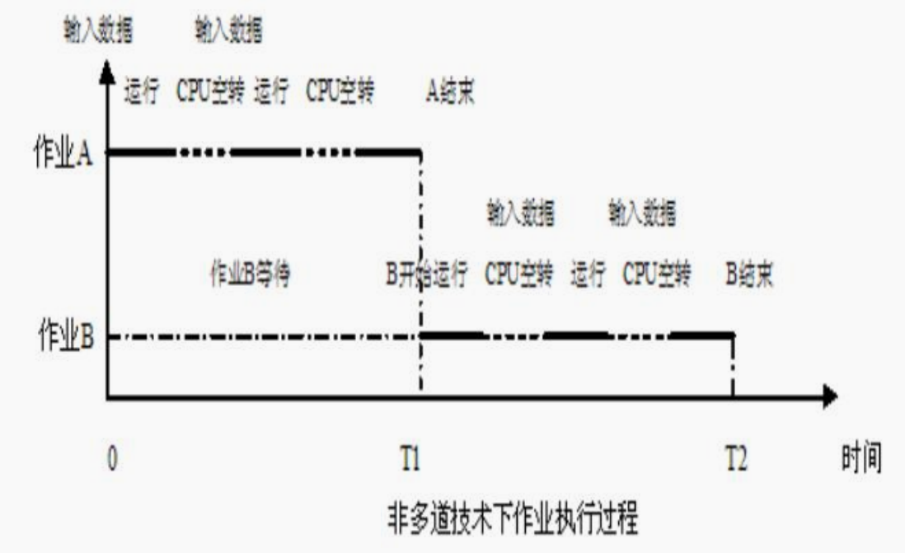

2. 多道程序设计

   现代计算机可以同时做几件事情，即同时运行几个程序：当它运行一个用户程序时，可以从磁盘或磁带上读数据，还可以向用户的终端或打印机上输出数据。使得多个设备并行操作。在多道程序系统中 CPU 不断地在多道程序之间转接多个程序是交叉执行的。

   多道技术下作业执行过程：

   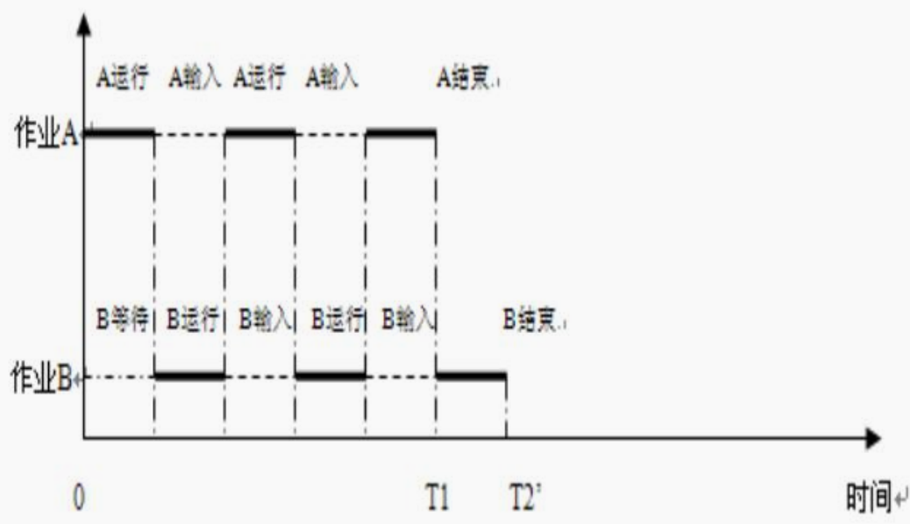

​ 并发程序运行图：

​ 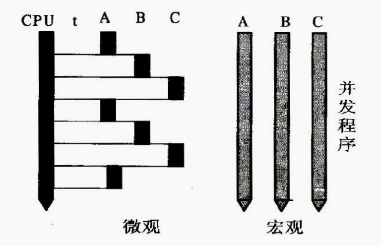

3. 程序并发执行的特征

   - 失去封闭性。

     系统资源不再由一个程序决定，受到并发程序的共同影响。

   - 程序与计算不再一一对应

     一个共享程序可被多个用户作业调用，从而形成多个“计算”。

   - 并发程序在执行期间相互制约。

     逻辑上彼此独立的程序由于公用独占资源会形成相互制约关系

### 2.1.2 进程概念

1. 进程概念的引入

   用程序这个静态概念已经不能如实反映程序并发执行过程中的这些特征。为此，人们引入“进程（Process）”这一概念来描述程序动态执行过程的本质。

2. 进程概念

   <font color="red">进程最根本的属性是动态性和并发性。</font>

   在广义上将进程定义为：**一个具有独立功能的程序关于某个数据集合的一次运行活动**。

   > 进程是程序在并发环境中的执行过程。

   - 动态性

     程序是静态、被动的概念，本身可以作为一种软件资源长期保存；而进程是程序的一次执行过程，是动态、主动的概念，有一定的生命期，会动态的产生和消亡。

   - 并发性

     传统的进程是一个独立运行的单位，能与其他进程并发执行。进程是作为资源申请和调度单位存在的；通常的程序是不能作为一个独立运行的单位而并发执行的。

   - 非对应性

     程序和进程无一一对应关系。一个程序可被多个进程共用；一个进程在其活动中又可顺序地执行若干程序。

   - 异步性

     各个进程在并发执行过程中会产生相互制约关系，造成各自前进速度的不可预测性。而程序本身是静态的，不存在这种异步特征。

   进程和程序的区别：

   |                                          进程                                          |                        程序                        |
   | :------------------------------------------------------------------------------------: | :------------------------------------------------: |
   |                                     进程是动态概念                                     |                   程序是静态概念                   |
   |                             进程具有并发性，宏观上同时运行                             | 程序本身具有顺序性，程序的并发执行是通过进程实现的 |
   | 进程具有独立性，是一个能独立运行的单位，是系统资源分配的基本单位，是运行调度的基本单位 |                 程序本身没有此特性                 |
   |                  程序和进程无一一对应关系，一个进程可顺序执行多个程序                  |              一个程序可由多个进程共用              |
   |                                进程异步前进，会相互制约                                |                  程序不具备此特性                  |

3. 进程的基本特征

   - 动态性

     进程是程序的执行过程，有生有亡，有活动有停顿，可以处于不同的状态。

   - 并发性

     多个进程的实体能够存在于同一内存中，在一段时间内斗得到运行。这样，使得一个进程的程序与其他进程的程序并发执行。

     > :: 这里的并发性是只外部并发性，单个进程内部的指令具有顺序性，按照顺序执行。

   - 调度性

     进程是系统中申请资源的单位，也是被调度的单位。操作系统中有很多调度程序，它们根据各自的策略调度合适的进程，为其运行提供条件。

   - 异步性

     各进程向前推进的速度是不可预知的，即异步方式运行。这造成进程间的相互制约，使程序执行失去再现性。为保证各程序的协调运行，需要采取必要的措施。

   - 结构性

     进程有一定的结构，它由程序段、数据段和控制结构（**进程控制块**）等组成。

   ```
   引入进程的利、弊：
   利：
   改善系统资源利用率、提高吞吐量
   弊：
   空间开销：每个进程创建PCB
   时间开销：协调调度、保护现场、CPU额外开销大。
   ```

## 2.2 进程的状态和组成

### 2.2.1 进程的状态及其转换

1. 进程的基本状态

- 运行状态

  运行态 (running)：`正在CPU上执行`进程所处状态为运行状态。在单 CPU 系统中，任何时候`最多只能有一个`处于运行状态

- 就绪状态

  就绪态(ready)：已经获得了`除CPU之外`的全部资源，等待系统分配 CPU，一旦获得 CPU,进程就可以变为运行态。

- 阻塞状态

  阻塞态(blocked)又称`等待态`、`睡眠态`当一个进程`因等待某个条件发生`而不能运行时处于阻塞态。处于阻塞态的进程在逻辑上是不能运行的，即使 CPU 空闲，它也`不能占用CPU`。

  三个状态的转换图：

  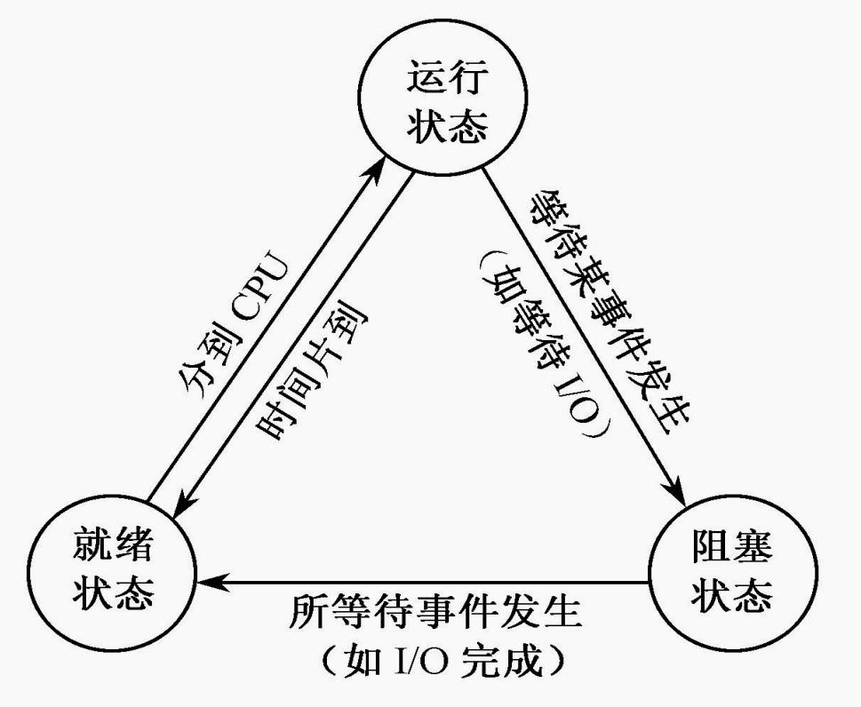

  图中可以看出以下几点：

  ① 处于就绪态的某进程被进程调度程序的执行选中时，被选中进程`由就绪态变为运行态`

  ② 进程由运行态变为阻塞态是由运行进程自己主动改变的。例如，一个正在运行的进程启动了某一外围设备后，等待该外围设备传输完成时，使自己由运行态变为阻塞态。

  ③ 进程`由阻塞态变为就绪态`总是由外界事件引起的。例如，上面所述的外围设备传输完成时，请求中断，由 I/0 中断处理程序把因等待这一 I/0 完成而阻塞的进程变为就绪态。

  ④ 处于运行态的进程被剥夺 CPU 时，它将由运行态变为就绪态。这通常与 CPU 的调度策略有关，如采用时间片轮转法调度时，当前运行进程用完分给它的时间片后，将由运行态变为就绪态；或采用优先级调度时，若有更高优先级的进程变为就绪态，当前进程被迫放弃 CPU，使自己由运行态变为就绪态，之后转进程调度。

上述三种状态是进程**最基本**的状态，在实际操作系统实现中，远不止这三种状态。进程从无到有是由创建而产生，故它的起点应为**建立**状态，当进程运行完后要消亡，此时的状态为**终止**状态。

​ 进程的五种状态及其转换：

​ 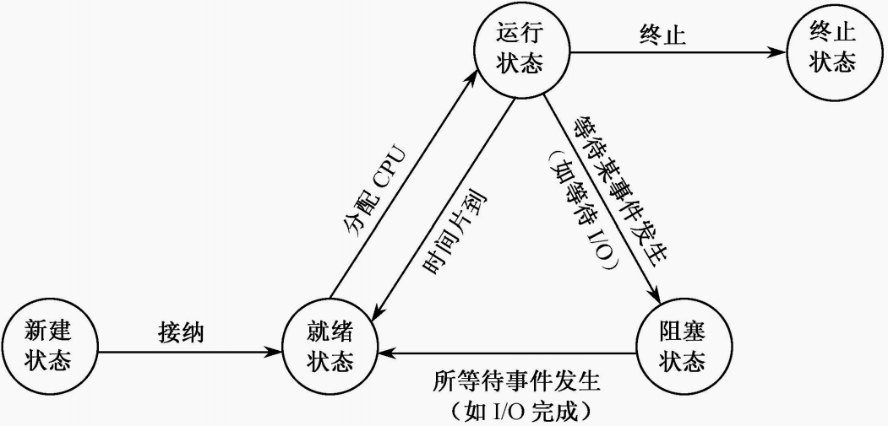

进程的挂起状态：

使处于基本状态的进程（就绪、执行、阻塞）处于**静止**(**非终止**)状态，此时系统回收被这些进程占用的内存资源，将其实体复制到外存的进程交换区。挂起**不等于撤销**，可通过解挂重新分配内存。（有些系统为了管理上的方便，设置了这一状态）

### 2.2.2 进程描述

1. 进程映像

   进程映像通常由程序、数据集合、栈和 PCB 4 部分组成。

   进程映像模型：

   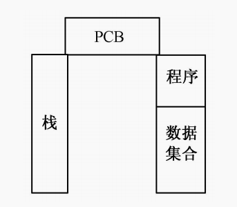

2. 进程控制块的组成

   **进程控制块**（PCB）也称进程描述块（Process Descriptor），它是进程组成中最关键的部分，其中含有进程的描述信息和控制信息，使进程动态特性的集中反映，是系统对进程施行识别和控制的依据。

   ∆ 进程控制块一般包括：

   - 进程名。它是唯一的标志对应进程的一个标志符或数字。有的系统用进程标识符作为进程的外部标志，用进程标识号（PID，在一定数值范围内的进程编号）作为进程的内部标志。

   - 特征信息。包括是系统进程还是用户进程，进程实体是否常驻内存等信息。
   - 进程状态信息。表明该进程的执行状态，是运行状态、就绪状态还是阻塞状态。
   - 调度优先权。表示进程获取 CPU 的优先级别。当多个就绪进程竞争 CPU 时，系统一般让优先权高的进程先占用 CPU。
   - 通信信息。反映该进程与哪些进程有什么样的通信关系，如等待哪个进程的信号等。
   - 现场保护区。当对应进程由于某种原因放弃使用 CPU 时，需要把它的一部分与运行环境有关的信息保存起来，以便在重新获得 CPU 后恢复正常运行。通常被保护的信息有程序计数器、程序状态字、各工作寄存器的内容等。
   - 资源需求、分配和控制方面的信息，如进程所需要或占有的 I/O 设备、磁盘空间、数据区等。
   - 进程实体信息。指出该进程的程序和数据的存储情况，在内存或外存的地址、大小等。
   - 族系关系。反映父子进程的隶属关系。
   - 其他信息。如文件信息、工作单元等。

3. 进程控制块的作用

- 每个进程有**惟一**的进程控制块
- 操作系统根据 PCB 对进程实施控制和管理
- 进程的动态、并发等特征是利用 PCB 表现出来的
- **PCB 是进程存在的惟一标识**。

### 2.2.3 进程队列

1. 线性方式

   PCB 线性队列示意图：

   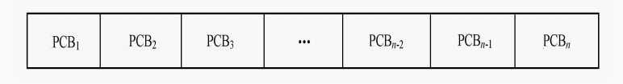

   这种方式的最大**优点**是**简单**，**节省存贮空间**其**缺点**是**系统开销大**。查找一个指定的 PCB 较费时间，平均要花费**半个 PCB 表**的时间。这是由于各种不同状态的 PCB 放在一起，使得找到某一指定状态的 PCB 经常要扫描整个线性队列。早期的 UNIX 系统就是采用这种形式的表。

2. 链接方式

   PCB 链接队列示意图：

   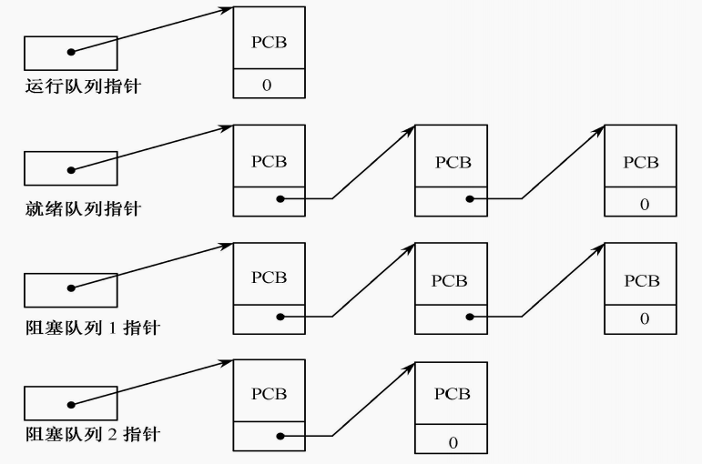

   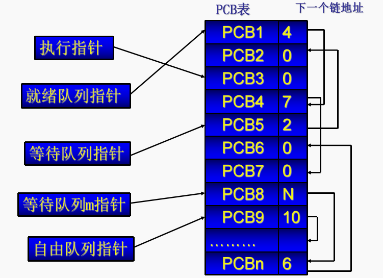

   **把处于同一状态的进程按照一定方式链接成一个队列**。每一个队列有一个专用队列指针指出该队列中第一个进程 PCB 所在位置。

3. 索引方式

   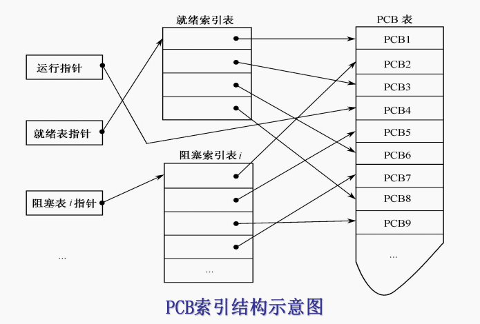

   对于**具有相同状态**的进程，分别设置各自的**PCB 索引表**，表目为 PCB 在 PCB 表中的地址，就构成了就绪索引表和等待索引表。

## 2.3 进程管理

> 原语：系统使用一些具有特定功能的程序段来创建、撤消进程以及完成进程各状态间转换等一系列有效管理。（进程管理），这些程序段的执行过程是不允许被中断的，或者说其执行过程不可分割。我们把这样的程序段叫原语

### 2.3.1 进程图

**进程图（Process Graph）**是描述进程族系关系的有向树。

**族系关系：**由父进程创建子进程，子进程创建下一个子进程，从而构成一棵树形进程族系图。

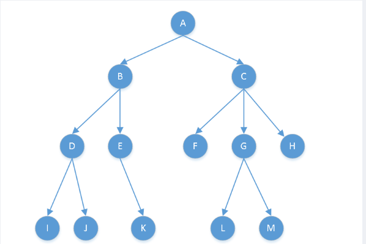

一棵树表示一个家族，根节点是祖先，一个子进程只有一个父进程，子进程可以继承父进程所拥有的资源，撤销父进程时`理论上`也必须同时撤销其所有子进程。

### 2.3.2 进程创建

引发进程创建的事件：调度新作业、用户登录、操作系统提供特定服务、派生新进程

- 创建新进程时要执行系统调用（如 UNIX/Linux 中的 fork）

- 主要过程：

  1. **申请**一个空闲的 PCB

  2. 为新进程**分配资源**

  3. 将新进程的 PCB**初始化**

  4. 将新进程加到就绪队列中

     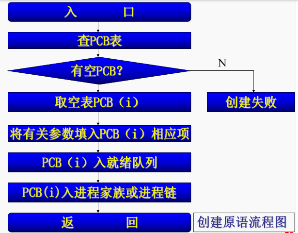

UNIX 系统父进程创建子进程 C 程序示例：

```C
#include <unistd.h>
#include <sys/types.h>
#include <stdio.h>

int main(int argc,char *argv[])
{
    int pid;
    pid = fork();//创建一个子进程
    if(pid<0){//出错，进程ID号不可能小于0
        fprintf(stderr, "Fork Failed");//输出出错消息——Fork Failed
        exit(-1);
    }
    else if (pid==0){
        execlp("bin/ls","ls",NULL);//执行/bin下面的ls命令
    }
    else {
        wait(NULL);//父进程等待子进程完成
        printf("Child Complete");//输出完成信息
        exit(0);
    }
}
```

### 2.3.3 进程终止

- 进程终止的原因：

  - 正常终止
  - 异常终止
  - 外部干扰

- 终止进程的主要操作：
  - **找到**指定进程的**PCB**，终止该进程的运行
  - **回收**该进程所占用的全部**资源**
  - 终止其所有**子孙进程**，回收它们所占用的全资源。
  - 将被终止进程的**PCB**从原来队列中**摘走**

### 2.3.4 进程阻塞

过程：

1. 立即停止当前进程的执行。
2. 将现进程的 CPU 现场送到 PCB 现场保护区中保存起来
3. 把该进程 PCB 中的现行状态由“运行”改为“阻塞”，把该进程插到具有相同事件的阻塞队列中。
4. 转到程序调度程序，重新从就绪队列中挑选一个合适进程投入运行。

### 2.3.5 进程唤醒

唤醒原语执行过程：

1. 把阻塞进程从相应的阻塞队列中摘下。
2. 将现行状态改为就绪状态，然后把该进程插入就绪队列中。
3. 如果被唤醒的进程比当前运行进程的优先级更高，则设置重新调度标志。
