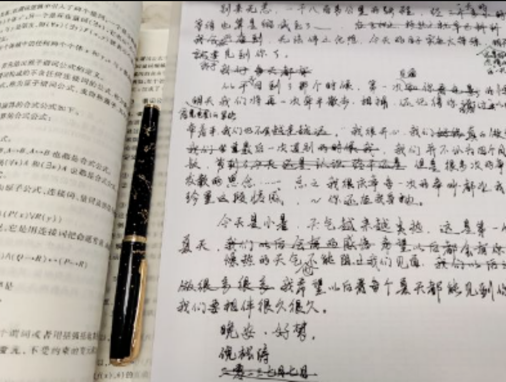
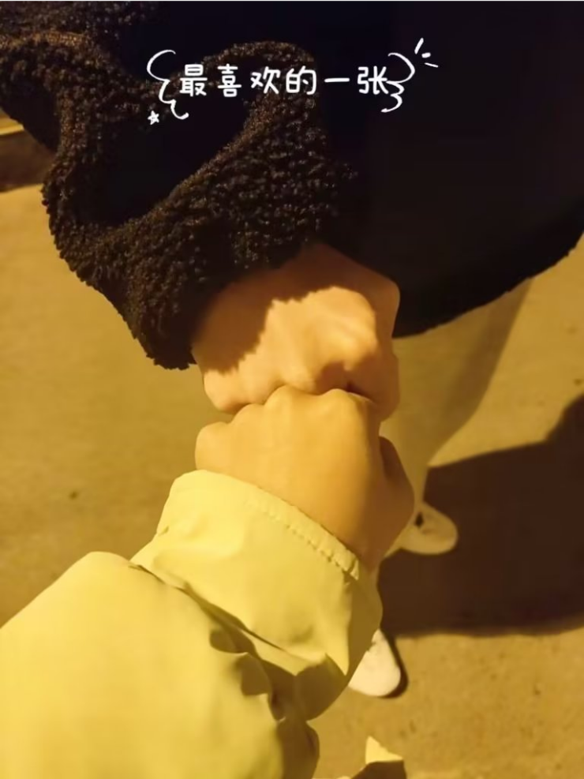

# 第一封情书

> 完成于二零二三年七月四日

## 正文

#### 展信佳：

​         别来无恙，一千八百多公里的路程，经一天的等待也算是缩减到了____。~~在飞机上、轻轨上就早已料到我会兴奋到~~，无法停止念想，今天的日子实在太特殊，~这是和你分开的最后一天？~明天终于要见到你了。

​	 ~~我们每天都有~~

​         似乎^又^回到了那个时候，第一次~~^见面^和你看电影~~的情绪，~看电影的紧张~，明天我们将再一次牵手散步，相拥，还记得你回答过：“*=以后，就算不牵着手，我们也不会越走越远*。”我很开心，我们~~好像~~真的做到了。~~我们~~最后一次道别~~的时候我~~，我们并不认为四个月很难熬，~~可到了今天还是认识  终于还是~~   但是很多次的争吵，日渐发散的思念……总之我很庆幸每一次的争吵都让我们更珍重这段情感，庆幸你还在我身边。

​	  今天是小暑，天气越来越炎热，这是第一个有你的夏天，~~我们以后会有的感激~~ ~~希望以后都会有你的陪伴~~燥热的天气也不能阻止我们见面，~~我们以后要一起做很多很多~~ 我希望以后每个夏天都能见到你，我爱你，我们要相伴很久很久。

​	   晚安，好梦。
​	   倪松涛

​	   ~~二零二三年七月七日~~

!

## 我是怎么写的？

### 构思

- 开头写写近况，交代当前我的状态
- 下一段写写回忆，对以前种种美好的阐述
- *=不管回忆还是近况，侧重点是接下来的见面*
- 最后写写对未来美好的期望，*=希望你能一直在我身边*

### 撰写

- 初稿，显然太久没写东西有些生疏
- 不追求华丽辞藻，*=但绝对真情实感*
- 修改，一些不恰当的地方适当修改
- 比如“好像做到了”，
>:: 什么好像，本来就做到了
- 落款，见面的日期在七月七日，小暑

### 遇到的问题

- ~~长时间没写字，书法美观问题~~ 练字解决了😏
- ~~和某人吵架，到分手，挂留言被看见了~~ *_所以有了第二封情书*！！！

## 结语

____

听说给某人看哭了，都是真实情感哦，*=我爱你宝宝*，慢慢感动吧。字数有点少（
