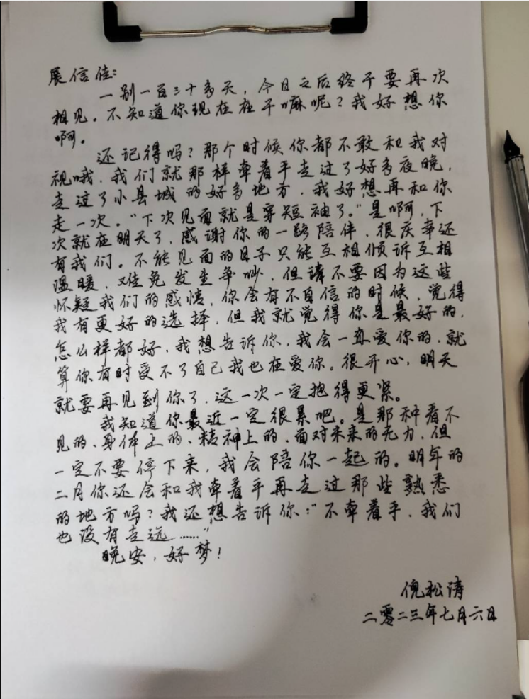

# 第二封情书

> 完成于二零二三年七月六日

## 正文

#### 展信佳：

 一别一百三十多天，今日之后终于要再次相见。不知道你现在在干嘛呢？我好想你啊。

 还记得吗？那个时候你都不敢和我对视哦。我们就那样牵着手走过了好多夜晚，走过了小县城的好多地方，我好想再和你走一次。“下次见面就是穿短袖了。”是啊，下次就在明天了，感谢你的一路陪伴，很庆幸还有我们。不能见面的日子只能互相倾诉互相温暖，难免发生争吵，但请不要因为这些怀疑我们的感情，你会有不自信的时候，觉得我有更好的选择，但我就觉得你是最好的，怎么样都好，我想告诉你，我会一直爱你的，就算你有时受不了自己我也在爱你，很开心，明天就要再见到你了，这一次一定抱得更紧。

 我知道你最近一定很累吧，是那种看不见的，身体上的，精神上的，面对未来的无力，但一定不要停下来，我会陪你一起的。明年的二月你还会和我牵着手再走过那些熟悉的地方吗？我还想告诉你：“不牵着手，我们也没有走远……”

 晚安，好梦！

 倪松涛

 二零二三年七月六日

## 这篇又是怎么写的？

### 构思

- 和第一篇一样，先回忆，再抒情，主要是第一篇被偷看了很多想写的都被看过了
- 其他详见[第一篇]("https://tryanel.github.io/%E7%AC%AC%E4%B8%80%E5%B0%81%E6%83%85%E4%B9%A6/")

### 遇到的问题

- 第二封用的蘸水笔，有些钩纸，下次轻点
- 蘸水笔墨水太浓容易渗，下次可尝试准备信封
- _\_信纸折叠后折痕观感不佳，想办法解决_

## 结语

> :: 这封情书是第一篇被看见后重新写的版本，可能没那么好了 😅
