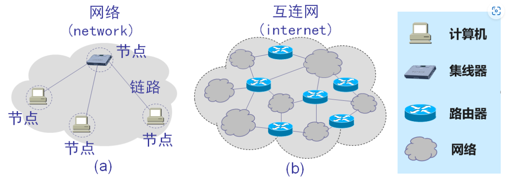
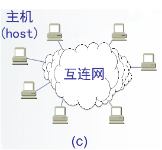
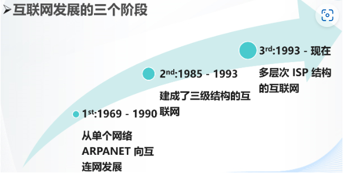
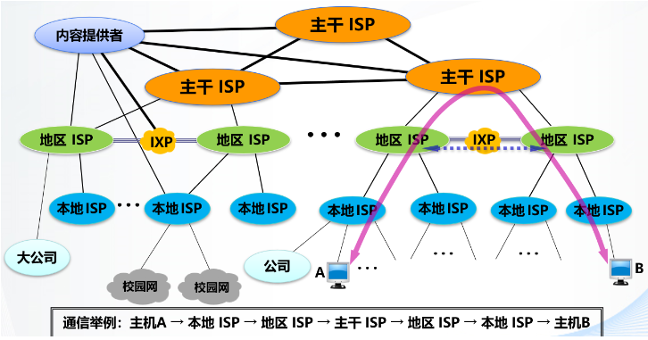
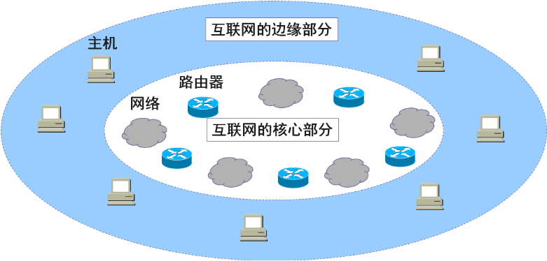
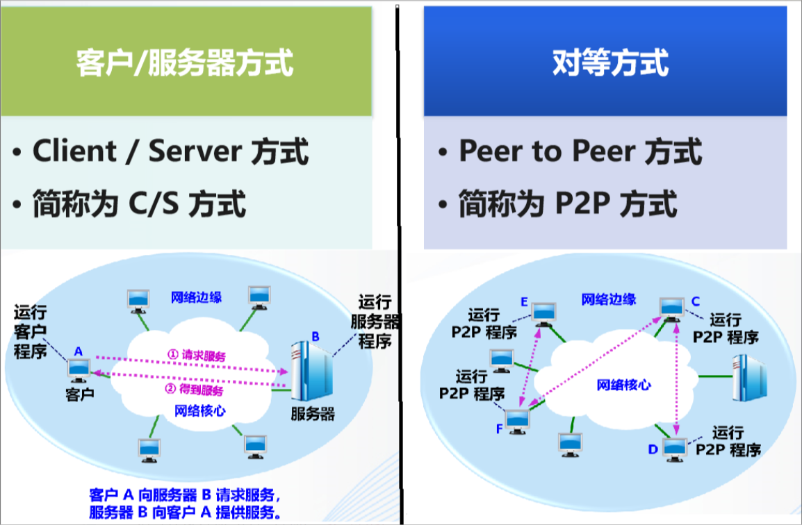
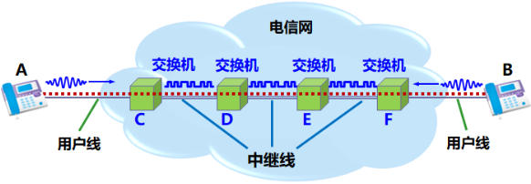
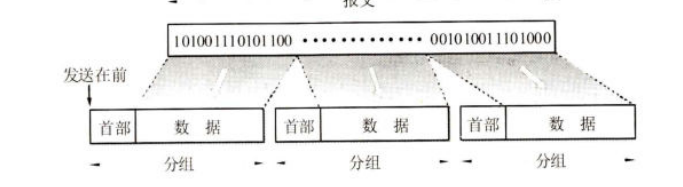
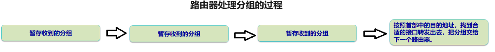
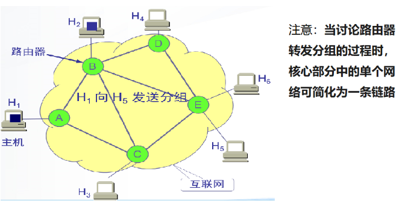

## 第一章 概述

## 1.1 计算机网络在信息时代中的作用

信息共享与传输、在线服务与应用、只是获取与教育、商业与经济活动、科学研究与发展、娱乐与休闲、社会互动与交流、远程工作与办公、健康医疗、政府服务与公共服务等。

## 1.2 互联网概述

### 1.2.1 网络的网络

计算机网络（简称为网络）由若干节点和连接这些节点的链路组成。有多个网络通过一些路由器相互连接起来，构成了一个覆盖范围更大的计算机网络，这样的网络成为互联网，互联网是“网络的网络”



网络把许多计算机连接在一起，而互连网则把许多网络通过一些路由器连接在一起。与网络相连的计算机常称为主机。



### 1.2.2 计算机网络发展的三个阶段



前两个懒得看

#### 第三阶段：1993 - 现在

**多层次ISP结构：**

- 主干ISP、地区ISP和本地ISP；
- 本地ISP提供接入到互联网的服务，并收取一定的费用；
- 不同层次的ISP覆盖面积大小和拥有的IP地址数目不同（**互联网上的主机都必须有IP地址才能上网**）。

具有三层ISP结构的互联网概念图：



> 互联网交换点 `IXP` 的主要作用就是允许两个` ISP 网络`直接相连并交换分组，而不需要再通过第三个网络来转发分组。
>
> `内容提供者` 是在互联网上向所有用户提供视频文件的公司，这种公司和前面的ISP不同，因为他们并不会向用户提供互联网的转接服务，而是提供视频内容的服务。
>
> `互联网服务提供者ISP`，可以是中国电信、中国移动、中国联通。
>
> `所谓的上网`就是指通过某ISP获取所需IP地址，以通过该ISP接入互联网。

## 1.3 互联网的组成

从工作方式上看，可划分为：

1. <font color="red">边缘部分</font>：由所有连接在互联网上的主机组成。这部分是**用户直接使用的**，用来进行通信（传输数据、音频或视频）和资源共享。

2. <font color="red">核心部分</font>：由大量网络和连接这些网络的路由器组成。这部分是**为边缘部分提供服务的**（提供连通性和交换）。

   

### 1.3.1 互联网边缘部分

主机 A 和主机 B 通信，实际上是指：

主机A 的某个进程和主机B 上的另一个进程进行通信。（计算机之间的通信）

主机之间的两种通信方式：



### 1.3.2 互联网的核心部分

☆ 核心部分要向边缘部分中的大量主机提供连通性，使边缘部分任何一台主机能与其他主机通信。

☆ 核心部分的关键设备是路由器 (router)，其任务是进行分组交换 (packet switching) ， 这是核心部分最重要的功能。

#### 数据交换的主要方式：

- 电路交换

  交换机连接电话线的方式称为电路。从通信资源的分配角度来看，交换就是按照某种方式动态地分配传输线路的资源。电路交换：整个报文的比特流连续地从源点直达终点，好像在一个管道中传送。

  

  当电话机的数量增多时，就要使用很多彼此连接起来的交换机来完成全网的交换任务。用这样的方法，就构成了覆盖全世界的电信网。

  电路交换的过程有三个阶段：

  ① 建立连接：建立一条专用的物理通路（占用通信资源）

  ② 通话：主叫和被叫方通电话（一直占用通信资源）

  ③ 释放连接：释放使用的专用的物理通路（归还通信资源）

  电路交换的一个重要特点就是在通话的全部时间内，通话的两个用户始终占用端到端的通信资源。

  
  
  缺点：线路的传输效率很低。计算机数据具有突发性，这导致使用电路交换传送数据时，通信线路的利用率很低，真正用来传送数据的时间往往不到 10%，甚至不到 1%。已被用户占用的通信线路资源在绝大部分时间里都是空闲的。所以计算机网络不采用电路交换，而是采用分组交换。
  
  <font color="red">这种必须经过“建立连接（占用通信资源）、通话（一直占用通信资源）、释放连接（归还通信资源）”三个步骤的交换方式称为电路交换。</font>

- 分组交换

  分组交换采用存储转发技术。要发送的整块数据称为一个**报文**。在发送报文之前，先把较长的报文划分成为一个个更小的**等长数据段**。在每一个数据段前面，加上一些由必要的控制信息组成的首部(header)后，就构成了一个分组(packet)。分组是在互联网中传送的数据单元。
  
  ① 发送端**连续的**将所有分组发送出去，直至结束
  
  
  
  ② 假定分组在传输过程中没有出现差错，在转发时也没有被丢弃。接收端收到分组后剥去首部，还原成原来的报文。
  
  <font color="#50a0ea">路由器对分组的处理：</font>
  
  **通过多个路由器的“接力”传输，分组最终会到达目的主机。**
  
  
  
  1. 路由器采用存储转发技术**先暂时存储收到的分组**，然后根据**首部中包含的目的地址**等重要 控制信息**查找转发表**进行转发。
  2. 各路由器之间定期交换各自掌握的路由信息，以创建和动态维护转发表。
  3. 每一个分组在互联网中**独立选择传输路径**，位于网络核心部分的路由器负责转发分组，即进行**分组交换**。
  
  <font color="#50a0ea">分组交换的注意事项：</font>
  
  
  
  每个分组独立选择传输路径，由于链路状态不断变化，分组路径也会动态变化！
  
  1：H1先将分组连续地发往与它直接相连的路由器A，而不是等第一个分组到达H5后再发送下一个分组；
  
  2：每个分组独立选择传输路径；
  
  3：单个分组经过多个路由器“接力”，最终到达目的主机H5；
  
  4：单个分组对通信资源是逐段占用的，只有当分组在链路上发送时才占用该链路，发送完毕即释放该链路。
  
  5：所有分组到达目的主机H5后，即可还原出原来的报文。
  
  <font color="#50a0ea">分组交换的优缺点：</font>
  
  ```
  优点：
  高效：在分组传输的过程中动态分配传输带宽，对通信链路逐段占用
  灵活：为每一个分组独立地选择最合适的转发路由
  迅速：以分组作为传送单位，不先建立连接就能向其他主机发送分组
  可靠：保证可靠性的网络协议；分布式多路由的网状拓扑结构，使网络有很好的生存性
  缺点：
  时延：组在各路由器存储转发时需要排队。
  不保证带宽：通信资源动态分配。
  增加开销：各分组必须携带控制信息；路由器要暂存分组，维护转发表等。
  ```
  
  


